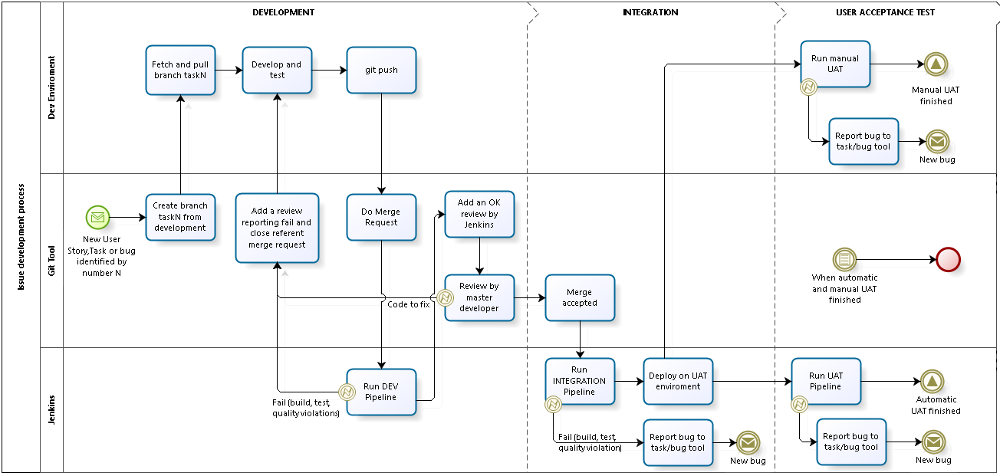
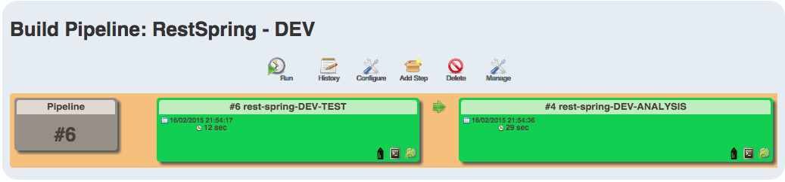

[this document is on construction]

# Automate independent Javascript and Rest-Spring Projects

(Project automation and management) + (Quality and CI process) approach for detached JavaScritp and Rest Resource applications

## 1. Branch Policy and Task Management

Even though branch policy and task management doesn't significantly affect build, test, and quality automation, this example we will consider a predefined brach policy and its interaction with task management and continuous integration process.

Before continue reading this document, I recommend you take a look and try understand <a href='http://nvie.com/posts/a-successful-git-branching-model/'>Git Workflow</a>. This is the base of our branch policy.

### Issue Development Process
Following diagram try to show issue development process adopted by this project.

These are some important points about this process:

* All programming effort have to be done at DEVELOPMENT stage. New programming demand generated by next stages have to be treated like a new bug or task that will generate new branch and start a new process instance
* On DEVELOPMENT stage: all tested, analysed and executed code (by Jenkins or programmers) is referent to a **feature branch** (before merge)
* On INTEGRATION stage: all tested, analysed and executed code (by Jenkins or programmers) is referent to the **development branch** (after merge)
* The DEVELOPMENT stage must ensure the consistence and quality of an feature branch
* The INTEGRATION stage must ensure the consistence and quality of the development branch, watching the changes caused by merges
* The UAT stage is not obligated to occur for each merge, because many times this is most expensive process stage and can be executed to test a set of system changes
* The Git tool must have a review policy (and tool) like Github Pull Request or GitLab Merge Request
* Jenkins must be a reviewer registered on the Git tool
* DELIVERY stage must exists but was not included

## 2. Running for Rest-Spring Project

Now we will show how to create and setup a Spring project (and its dependencies) with continuous integration and aligned with our issue development process.

The application we wrote have only a resource named `books` that accept 4 HTTP methods (GET, POST, PUT, DELETE) and executes read, create, update and delete of a `book` object.

`TIP: to better comprehension, download and see the project's source code in the "spring-project" directory`

### Create a Spring Project 

Our Rest Spring application uses Spring-boot as a way to simplify project configuration and run.
Having a correct directory structure you need only a pom.xml:

----
	<project xmlns="http://maven.apache.org/POM/4.0.0" xmlns:xsi="http://www.w3.org/2001/XMLSchema-instance"
	xsi:schemaLocation="http://maven.apache.org/POM/4.0.0 http://maven.apache.org/maven-v4_0_0.xsd">
	<modelVersion>4.0.0</modelVersion>
	<groupId>andremeirelesa.automate</groupId>
	<artifactId>restspring</artifactId>
	<packaging>jar</packaging>
	<version>0.1</version>
	<name>restspring</name>
	<url>http://maven.apache.org</url>
	
  	<parent>
  		<groupId>org.springframework.boot</groupId>
  		<artifactId>spring-boot-starter-parent</artifactId>
  		<version>1.2.1.RELEASE</version>
  	</parent>
  
  	<dependencies>
  		<dependency>
  			<groupId>org.springframework.boot</groupId>
  			<artifactId>spring-boot-starter-web</artifactId>
  		</dependency>
  		<dependency>
  			<groupId>org.springframework.boot</groupId>
  			<artifactId>spring-boot-starter-test</artifactId>
  			<scope>test</scope>
  		</dependency>
  	</dependencies>
  
  	<build>
  		<plugins>
  			<plugin>
  				<groupId>org.springframework.boot</groupId>
  				<artifactId>spring-boot-maven-plugin</artifactId>
  			</plugin>
  		</plugins>
  	</build>
</project>
----

Now you are ready to run the first DEV-pipeline's job.

### Jenkins DEV Pipeline

We consider now you have Jenkins server installed and runnning. First you need know that `pipeline` is just a view offered by <a href="https://wiki.jenkins-ci.org/display/JENKINS/Build+Pipeline+Plugin">Build Pipeline Plugin</a> to illustrate downstream and upstream of Jenkins jobs (jobs that runs another jobs).

Now, see DEV pipeline we defined:

#### DEV: Job #1 - TEST (rest-spring-DEV-TEST)

Previously I said you are ready to run DEV pipeline. This means that you do not need configure anything in your project to run the TEST job. Ok, let's go.

This job consists in

- declare parameters
- clone project repository
- run a maven goal (test)
- report fail if exists

[this document is on construction]

